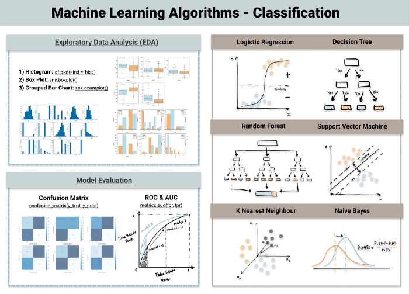
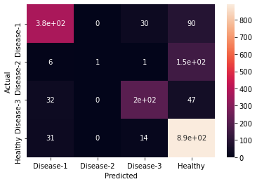

<!--  -->

# **Pharmahacks 2022**

## Phyla Challenge #2 - RandomForest Approach

- Aleksandrina Getova
- Nour Abiad
- Soheib El-Harrache
- Stefan Barbu

---

# The project

Develop a multi-label classification model to classify different diseases based on the microorganisms in the gut microbiome.

- ~ 7500 samples
- 3 diseases + 1 healthy labels

---

# Choosing the algo, Part 1

---

# Choosing the algo, Part 2

> One of the biggest problems in machine learning is overfitting, but most of the time this won’t happen thanks to the random forest classifier. If there are enough trees in the forest, the classifier won’t overfit the model.

Source: https://builtin.com/data-science/random-forest-algorithm

>[...] the Random Forest (RF) algorithm showed superior accuracy comparatively. Of the 17 studies where it was applied, RF showed the highest accuracy in 9 of them, i.e., 53%.

Source: https://bmcmedinformdecismak.biomedcentral.com/articles/10.1186/s12911-019-1004-8

*We also took notes of Alexis Nolin-Lapalme's intro to Machine Learning*

---

# Tools

- Python
- `scikit-learn` - Machine Learning
- `seaborn` - Heatmaps
- `pandas` - Data Analysis

---

# Performance

- **F1 Score - Micro:**  0.7888829502939605
- **F1 Score - Macro:**  0.6092643971812871
- **F1 Score - Weighted:**  0.7535328039740695
- **Cohen’s kappa score:**  0.6355790715803891

---

# Improving the project

- Use `sklearn-onnx` to export our model in a standard format
- Tuning to separate disease-2 from our healthy samples

---

# Improving the dataset

- Include q-values -> FDR
- Labels before features
